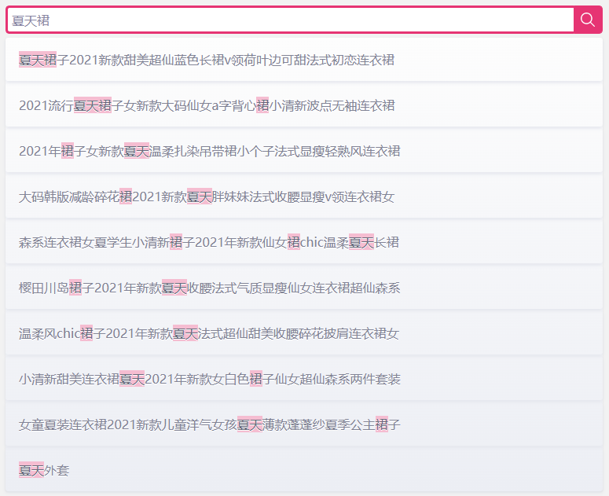

<p align="center">
  
</p>

<h1 align="center">Meilisearch</h1>

[](https://packagist.org/packages/tinywan/meilisearch) 
[](https://packagist.org/packages/tinywan/meilisearch) 
[](https://packagist.org/packages/tinywan/meilisearch) 
[](https://packagist.org/packages/tinywan/meilisearch) 
[](https://packagist.org/packages/tinywan/meilisearch)

MeiliSearch是一个功能强大，快速，开源，易于使用和部署的搜索引擎。搜索和索引都是高度可定制的。允许输入、过滤器和同义词等特性都是开箱即用的。是近两年开源的项目，同样也支持中文分词，在小数据规模下可以实现比[ElasticSearch](https://www.elastic.co/cn/elasticsearch/)更加快速和易用的搜索体验。更多安装、配置、使用等细节请参考[官方文档](https://docs.meilisearch.com/)或交友网站

## 安装

```sh
composer require tinywan/meilisearch
```

## 使用

### 初始化配置

```php
$config = [
    'url' => 'http://127.0.0.1:7700',
    'key' => '',
    'guzzle' => [
        'headers' => [
            'charset' => 'UTF-8',
        ],
        'timeout' => 20
    ],
];

// 调用 config 方法初始化
Tinywan\Meilisearch::config($config);
```

### 基本使用

#### 1. 创建索引

```php
Tinywan\Meilisearch::search()->index('meilisearch');
```

#### 2. 添加文档

```php
$documents = [
    ['id' => 1, 'title' => '酒吧墙面装饰美式复古咖啡厅'],
    ['id' => 2, 'title' => '工艺品桌面摆件'],
    ['id' => 3, 'title' => '现代简约三联餐厅壁画玄关挂画'],
    ['id' => 4, 'title' => '现代简约时尚单头餐吊灯创意个性吧台']
];
Tinywan\Meilisearch::search()->index('meilisearch')->addDocuments($documents);
```

#### 3. 默认查询

```php
Tinywan\Meilisearch::search()->index('meilisearch')->search('桌面摆件')->getRaw();
```

- `getRaw()` 返回数组

## 返回字段

- `hits` 命中的结果
- `offset` 页大小
- `limit` 每页条数
- `processingTimeMs` 处理耗时
- `query` 查询的内容

## 前端集成

;

## 数据查询

分页查询
```
http://172.30.32.1:7700/indexes/mall_goods/search?limit=1&offset=3
http://172.30.32.1:7700/indexes/mall_goods_27_30/search?q=10
```
- `offset` 页大小
- `limit` 每页条数

关键字查询
```
http://172.30.32.1:7700/indexes/mall_goods_27_30/search?q=桌面摆件
```

## 数据添加

### 已经存在的数据

1. 直接批量添加即可

```php
$documents = Db::table('mall_goods')
    ->field('id,name,default_image')
    ->whereIn('goods_id',[30])
    ->limit(2)
    ->select()
    ->toArray();
Tinywan\Meilisearch::search()->index('meilisearch')->addDocuments($documents);
```

2. 新添加的商品，单独添加

```php
$documents = [
    ['id' => 1, 'title' => '酒吧墙面装饰美式复古咖啡厅'],
];
Tinywan\Meilisearch::search()->index('meilisearch')->addDocuments($documents);
```

## Other

```phpregexp
vendor/bin/phpstan analyse -l 5 src

vendor/bin/php-cs-fixer fix src
```